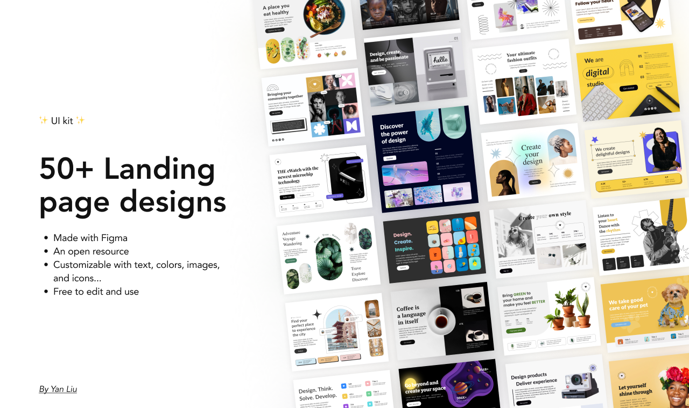

# 🚀 50 Landing Pages – HTML & CSS Practice

    

### 🌟 Stargazers

I appreciate the support from all the Stargazers! 💖

### 🙌 Contributions

Feel free to fork, explore, or send a pull request if you have cool ideas or improvements. Whether it’s fixing layout issues, optimizing CSS — I’d love to see your take! 😊

### 🖌️ Credits

Thanks to [Yan Liu](https://www.figma.com/@yanliu) for the [50+ Landing page designs](https://www.figma.com/community/file/1127302394641561751) on Figma.
